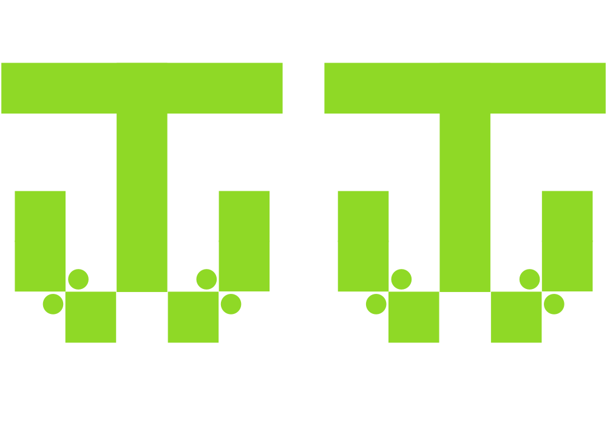

# joobjoob

Joobjoob is a free data repository for fun and unique datasets, which I have compiled from the internet. 
I will feature three libraries. Each library will be dedicated to unique regional dataset obtained from that particular region or in that language. 

## K5 library
K5 is a library dedicated to **Korea**-related datasets. 
* K5DQ: Metadata on Korean dramas
* K5NBH: Game(match) data on Korea's famous cooking reality show

## J5 library
J5 is a library dedicated to **Japan**-related datasets. </n>
To be updated soon! 

## C5 library
C5 is a library dedicated to **China**-related datasets. </n>
To be updated soon! 
